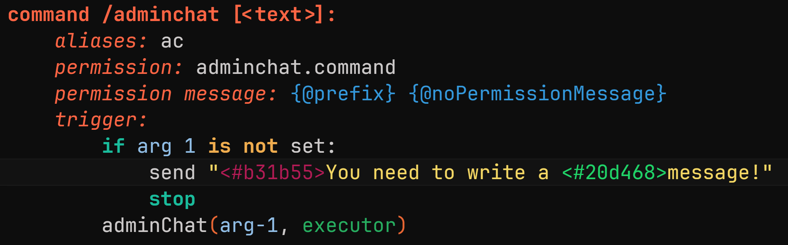

---
prev:
   text: 'Experiments - Projects'
   link: '/usage/experiments/projects'
next: 
   text: 'Addons - Analyzer'
   link: '/addons/analyzer'
---

# Hex Preview

::: danger
This feature is experimental and may not work as expected. Use it at your own risk.
:::

The **Hex Preview** feature highlights hex color values in their actual color.
So, if you have a color like `<#b31b55>` in your text, it will be highlighted in the color that the hex value represents.

