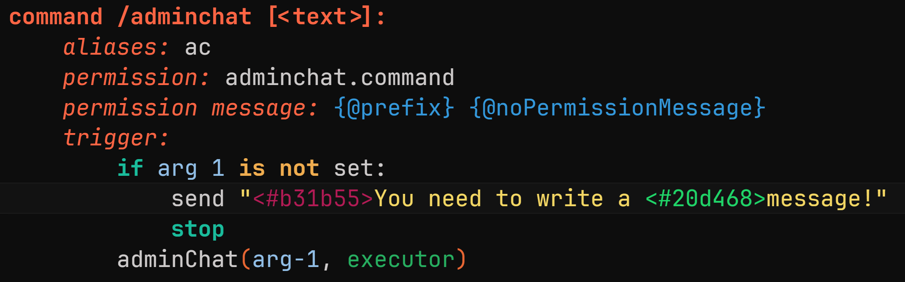

---
prev:
   text: 'Эксперименты - Проекты'
   link: '/usage/experiments/projects'
next: 
   text: 'Дополнения - Анализатор'
   link: '/addons/analyzer'
---

# Hex предпросмотр

::: danger
Эта функция экспериментальная и может работать не так, как ожидается. Используйте её на свой страх и риск.
:::

Функция **Hex Preview** подсвечивает hex значения цветов их фактическим цветом.
Так, если у вас есть цвет вроде `<#b31b55>` в вашем тексте, он будет подсвечен цветом, который представляет это hex значение.

