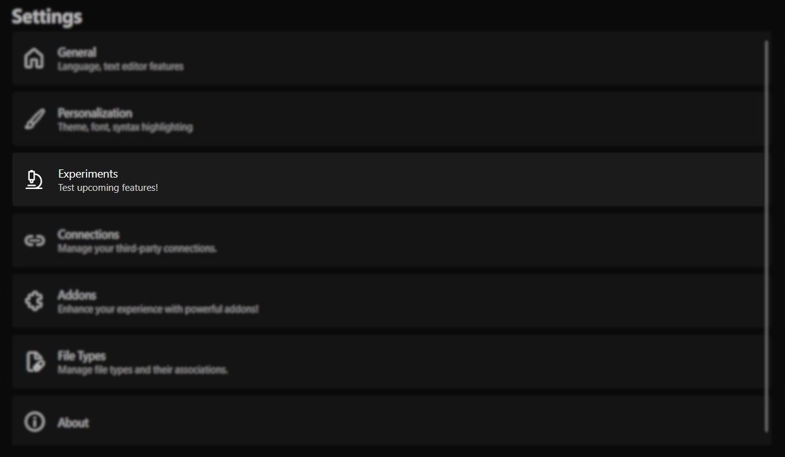

---
prev:
   text: 'Использование - FTP интеграция'
   link: '/usage/ftp-integration'
next: 
   text: 'Эксперименты - Автодополнение кода'
   link: '/usage/experiments/code-completion'
---

# Эксперименты

::: danger
Эксперименты называются так не просто так. Они могут быть нестабильными, неполными и ухудшить ваш опыт использования.
:::

Эксперименты — это функции, которые позволяют вам тестировать новую функциональность.
Их можно легко включить в настройках в специальном разделе "Эксперименты".

